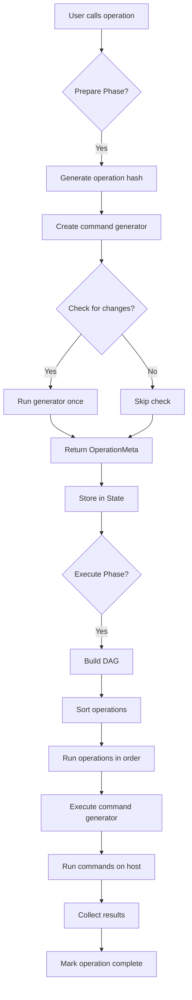

## Overview

pyinfra is built around a unique **two-phase execution model** that separates operation discovery from execution. This architecture enables predictable, idempotent infrastructure management with efficient parallel execution.

<Note>
The two-phase model is fundamental to how pyinfra works. Understanding this concept is key to mastering the framework.
</Note>

## The Two-Phase Model

pyinfra's execution is divided into two distinct phases:

### Phase 1: Prepare (Discovery/Diff)

During the **Prepare phase**, pyinfra:

1. **Discovers operations**: Executes your deploy scripts to discover all operations
2. **Collects facts**: Gathers current state from target hosts
3. **Determines changes**: Compares desired state against current state
4. **Builds operation DAG**: Creates a dependency graph of operations
5. **Generates command list**: Produces the exact commands needed

```python
from pyinfra.api.state import StateStage

# From src/pyinfra/api/state.py:93-104
class StateStage(IntEnum):
    # Setup - collect inventory & data
    Setup = 1
    # Connect - connect to the inventory
    Connect = 2
    # Prepare - detect operation changes
    Prepare = 3
    # Execute - execute operations
    Execute = 4
    # Disconnect - disconnect from the inventory
    Disconnect = 5
```

During this phase, operations are **called but not executed**. The `@operation` decorator intercepts the call and returns an `OperationMeta` object instead:

```python
# From src/pyinfra/api/operation.py:264-380
@wraps(func)
def decorated_func(*args, **kwargs) -> OperationMeta:
    state = context.state
    host = context.host

    # Check we're in the correct stage
    if pyinfra.is_cli and (
        state.current_stage < StateStage.Prepare or state.current_stage > StateStage.Execute
    ):
        raise Exception("Cannot call operations outside of Prepare/Execute stages")

    # Generate operation metadata
    names, add_args = generate_operation_name(func, host, kwargs, global_arguments)
    op_order, op_hash = solve_operation_consistency(names, state, host)

    # Create a generator that will yield commands later
    def command_generator() -> Iterator[PyinfraCommand]:
        # ... operation logic runs here during execution
        for command in func(*args, **kwargs):
            if isinstance(command, str):
                command = StringCommand(command.strip())
            yield command

    # Determine if this operation will make changes
    op_is_change = None
    if state.should_check_for_changes():
        op_is_change = False
        for _ in command_generator():  # Iterate once to check
            op_is_change = True
            break

    return OperationMeta(op_hash, op_is_change)
```

<Tip>
The Prepare phase is what enables pyinfra's "dry-run" mode (`pyinfra ... --dry`). Since operations are discovered but not executed, you can see exactly what would change.
</Tip>

### Phase 2: Execute

During the **Execute phase**, pyinfra:

1. **Sorts operations**: Uses the DAG to determine optimal execution order
2. **Executes in parallel**: Runs operations across hosts concurrently
3. **Handles errors**: Manages failures and retries
4. **Collects results**: Tracks success/failure for each operation
5. **Completes operations**: Marks operations as complete with results

```python
# From src/pyinfra/api/operations.py:38-60
def run_host_op(state: State, host: Host, op_hash: str) -> bool:
    state.trigger_callbacks("operation_host_start", host, op_hash)

    if op_hash not in state.ops[host]:
        logger.info(f"{host.print_prefix}{click.style('Skipped', 'blue')}")
        return True

    op_meta = state.get_op_meta(op_hash)
    logger.debug("Starting operation %r on %s", op_meta.names, host)

    if host.executing_op_hash is None:
        host.executing_op_hash = op_hash
    else:
        host.nested_executing_op_hash = op_hash

    try:
        return _run_host_op(state, host, op_hash)
    finally:
        if host.nested_executing_op_hash:
            host.nested_executing_op_hash = None
        else:
            host.executing_op_hash = None
```

## State Management

The `State` class (defined in `src/pyinfra/api/state.py`) is the central coordinator for a pyinfra deployment:

```python
# From src/pyinfra/api/state.py:145-283
class State:
    """
    Manages state for a pyinfra deploy.
    """

    # A pyinfra.api.Inventory which stores all our pyinfra.api.Host's
    inventory: "Inventory"

    # A pyinfra.api.Config
    config: "Config"

    # Main gevent pool for parallel execution
    pool: "Pool"

    # Current stage this state is in
    current_stage: StateStage = StateStage.Setup

    # Whether we are executing operations (ie hosts are all ready)
    is_executing: bool = False

    # Whether we should check for operation changes
    check_for_changes: bool = True

    # Op basics
    op_meta: dict[str, StateOperationMeta] = {}  # operation hash -> metadata

    # Op dict for each host
    ops: dict[Host, dict[str, StateOperationHostData]] = {}

    # Meta dict for each host
    meta: dict[Host, StateHostMeta] = {}

    # Results dict for each host
    results: dict[Host, StateHostResults] = {}
```

### State Data Structures

pyinfra uses several key data structures to manage operations:

#### StateOperationMeta

Shared metadata about an operation across all hosts:

```python
# From src/pyinfra/api/state.py:106-117
class StateOperationMeta:
    names: set[str]
    args: list[str]
    op_order: tuple[int, ...]
    global_arguments: AllArguments

    def __init__(self, op_order: tuple[int, ...]):
        self.op_order = op_order
        self.names = set()
        self.args = []
        self.global_arguments = {}  # type: ignore
```

#### StateOperationHostData

Host-specific operation data:

```python
# From src/pyinfra/api/state.py:119-125
@dataclass
class StateOperationHostData:
    command_generator: Callable[[], Iterator[PyinfraCommand]]
    global_arguments: AllArguments
    operation_meta: OperationMeta
    parent_op_hash: Optional[str] = None
```

#### OperationMeta

The return value from operations that tracks execution status:

```python
# From src/pyinfra/api/operation.py:43-204
class OperationMeta:
    _hash: str
    _combined_output: Optional[CommandOutput] = None
    _commands: Optional[list[Any]] = None
    _maybe_is_change: Optional[bool] = None
    _success: Optional[bool] = None
    _retry_attempts: int = 0
    _max_retries: int = 0
    _retry_succeeded: Optional[bool] = None

    def __init__(self, hash, is_change: Optional[bool]):
        self._hash = hash
        self._maybe_is_change = is_change

    # Status checks
    def is_complete(self) -> bool:
        return self._success is not None

    @property
    def will_change(self) -> bool:
        """Check if operation will make changes (Prepare phase)"""
        if self._maybe_is_change is not None:
            return self._maybe_is_change
        # ... check command generator

    def did_change(self) -> bool:
        """Check if operation made changes (Execute phase)"""
        self._raise_if_not_complete()
        return bool(self._success and len(self._commands or []) > 0)

    def did_succeed(self) -> bool:
        self._raise_if_not_complete()
        return self._success is True
```

## Operation Execution Flow

Here's the complete flow from operation call to execution:



## Parallel Execution

pyinfra uses **gevent** for concurrent execution across multiple hosts:

```python
# From src/pyinfra/api/state.py:237-244
# Setup greenlet pools
self.pool = Pool(config.PARALLEL)
self.fact_pool = Pool(config.PARALLEL)
```

By default, pyinfra calculates optimal parallelism:

```python
# From src/pyinfra/api/state.py:219-227
if not config.PARALLEL:
    # Optimum: ~20 parallel SSH processes per CPU core
    cpus = cpu_count()
    ideal_parallel = cpus * 20

    config.PARALLEL = min(ideal_parallel, len(inventory), MAX_PARALLEL)
```

<Note>
The maximum parallelism is limited by the system's file descriptor limit, since each SSH connection requires file descriptors.
</Note>

## Operation DAG (Dependency Graph)

Operations are ordered using a Directed Acyclic Graph (DAG) to handle dependencies:

```python
# From src/pyinfra/api/state.py:310-344
def get_op_order(self):
    ts: TopologicalSorter = TopologicalSorter()

    # Build the DAG from each host's operation order
    for host in self.inventory:
        for i, op_hash in enumerate(host.op_hash_order):
            if not i:
                ts.add(op_hash)  # First operation has no dependencies
            else:
                ts.add(op_hash, host.op_hash_order[i - 1])  # Depends on previous

    final_op_order = []

    try:
        ts.prepare()
    except CycleError as e:
        raise PyinfraError(
            "Cycle detected in operation ordering DAG.\n"
            f"    Error: {e}\n\n"
            "    This can happen when using loops in operation code"
        )

    while ts.is_active():
        # Sort operations that can run in parallel by line number
        node_group = sorted(
            ts.get_ready(),
            key=lambda op_hash: self.op_meta[op_hash].op_order,
        )
        ts.done(*node_group)
        final_op_order.extend(node_group)

    return final_op_order
```

<Tip>
The DAG ensures operations run in the correct order while maximizing parallelism. Operations with no dependencies can run simultaneously across different hosts.
</Tip>

## Context Management

pyinfra uses context variables to track the current host and state:

```python
# From src/pyinfra/context.py
from pyinfra.context import ctx_host, ctx_state

# Access current host
current_host = ctx_host.get()

# Access current state
current_state = ctx_state.get()

# Set context for execution
with ctx_state.use(state):
    with ctx_host.use(host):
        # Operations run here with this context
        operation(*args, **kwargs)
```

This allows operations and facts to access the current execution context without explicit parameter passing.

## Error Handling and Retries

pyinfra includes sophisticated error handling with retry support:

```python
# From src/pyinfra/api/operations.py:70-189
# Extract retry arguments
retries = global_arguments.get("_retries", 0)
retry_delay = global_arguments.get("_retry_delay", 5)
retry_until = global_arguments.get("_retry_until", None)

retry_attempt = 0
while retry_attempt <= retries:
    did_error = False
    executed_commands = 0
    commands = []

    for command in op_data.command_generator():
        commands.append(command)
        status = command.execute(state, host, connector_arguments)

        if status is False:
            did_error = True
            break

        executed_commands += 1

    # Check if we should retry
    should_retry = False
    if retry_attempt < retries:
        if did_error:
            should_retry = True
        elif retry_until and not did_error:
            # Retry based on custom condition
            output_data = {...}
            should_retry = retry_until(output_data)

    if should_retry:
        retry_attempt += 1
        host.log_styled(f"Retrying (attempt {retry_attempt}/{retries})...")
        time.sleep(retry_delay)
        continue

    break
```

## Callback System

pyinfra provides callback hooks for monitoring execution:

```python
# From src/pyinfra/api/state.py:41-91
class BaseStateCallback:
    @staticmethod
    def host_before_connect(state: State, host: Host):
        pass

    @staticmethod
    def host_connect(state: State, host: Host):
        pass

    @staticmethod
    def operation_start(state: State, op_hash):
        pass

    @staticmethod
    def operation_host_success(state: State, host: Host, op_hash, retry_count: int = 0):
        pass

    @staticmethod
    def operation_host_error(state: State, host: Host, op_hash, retry_count: int = 0):
        pass

# Register callbacks
state.add_callback_handler(MyCallbackHandler())
```

## Command Types

pyinfra supports multiple command types:

### StringCommand

Shell commands to execute:

```python
from pyinfra.api import StringCommand

command = StringCommand("apt-get", "update")
# Executes: apt-get update
```

### FunctionCommand

Python functions to run:

```python
from pyinfra.api import FunctionCommand

def my_function(state, host, *args):
    # Python code runs here on the control machine
    return True

command = FunctionCommand(my_function, args)
```

### FileUploadCommand / FileDownloadCommand

File transfer operations:

```python
from pyinfra.api import FileUploadCommand

command = FileUploadCommand(src="/local/file", dest="/remote/file")
```

## Best Practices

<CardGroup cols={2}>
  <Card title="Idempotency" icon="check-double">
    Design operations to be safely re-runnable. The two-phase model helps by checking state first.
  </Card>
  
  <Card title="Fact Usage" icon="magnifying-glass">
    Use facts to check current state instead of assuming. Let pyinfra determine what needs to change.
  </Card>
  
  <Card title="Operation Order" icon="list-ol">
    Rely on the DAG for dependencies. Define operations in logical order and let pyinfra optimize execution.
  </Card>
  
  <Card title="Error Handling" icon="triangle-exclamation">
    Use `_ignore_errors`, `_continue_on_error`, and `_retries` for robust deployments.
  </Card>
</CardGroup>

## Performance Characteristics

### Prepare Phase

- **Time complexity**: O(hosts × operations × facts)
- **Parallelism**: Facts are collected in parallel across hosts
- **Network**: One round-trip per unique fact per host

### Execute Phase

- **Time complexity**: O(operations × commands_per_operation)
- **Parallelism**: Operations run in parallel across hosts (respecting DAG)
- **Network**: One round-trip per command (pipelined where possible)

## Key Takeaways

1. **Two phases**: Prepare discovers and diffs, Execute runs commands
2. **Operation generators**: Commands are generated lazily via iterators
3. **DAG ordering**: Operations are topologically sorted for optimal execution
4. **Parallel execution**: gevent enables concurrent operations across hosts
5. **State tracking**: Comprehensive state management through State, Host, and OperationMeta classes
6. **Context-aware**: Operations access current host/state via context variables

## Related Concepts

<CardGroup cols={2}>
  <Card title="Operations" icon="gear" href="/concepts/operations">
    Learn how to define operations using the @operation decorator
  </Card>
  
  <Card title="Facts" icon="database" href="/concepts/facts">
    Understand how facts collect state information
  </Card>
  
  <Card title="State" icon="circle-nodes" href="/concepts/state">
    Deep dive into the State class and state management
  </Card>
  
  <Card title="Connectors" icon="plug" href="/concepts/connectors">
    Explore how connectors interface with target systems
  </Card>
</CardGroup>
