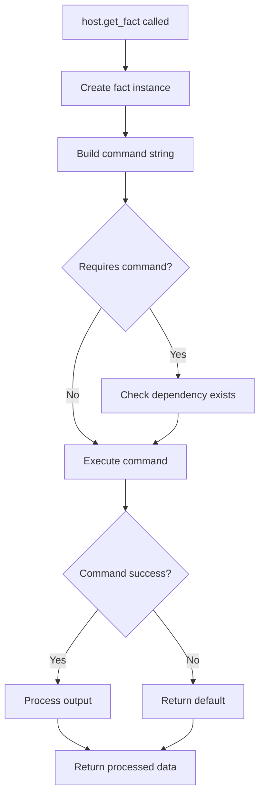

## Overview

Facts are pyinfra's mechanism for collecting information about target hosts. They enable **idempotent operations** by allowing you to check the current state before making changes. Every fact runs a command on the target host, processes the output, and returns structured data.

<Note>
Facts are the foundation of idempotent infrastructure management. Always use facts to check state rather than assuming what exists on target hosts.
</Note>

## The FactBase Class

All facts inherit from the `FactBase` class (defined in `src/pyinfra/api/facts.py`):

```python
# From src/pyinfra/api/facts.py:50-96
class FactBase(Generic[T]):
    name: str

    abstract: bool = True

    shell_executable: str | None = None

    command: Callable[..., str | StringCommand]

    def requires_command(self, *args, **kwargs) -> str | None:
        """Command that must exist for this fact to work."""
        return None

    @staticmethod
    def default() -> T:
        """Set the default value when fact cannot be collected."""
        return cast(T, None)

    def process(self, output: list[str]) -> T:
        """Process command output into structured data."""
        return cast(T, "\n".join(output))

    def process_pipeline(self, args, output):
        """Process multiple fact calls in a pipeline."""
        return {arg: self.process([output[i]]) for i, arg in enumerate(args)}
```

### Key Components

1. **`command`**: Method that returns the shell command to execute
2. **`process`**: Method that transforms command output into structured data
3. **`default`**: Static method returning the default value on failure
4. **`requires_command`**: Optional command dependency check

## Creating Facts

### Simple Fact Example

A basic fact that returns a single string:

```python
# From src/pyinfra/facts/server.py:23-30
class User(FactBase):
    """
    Returns the name of the current user.
    """

    def command(self):
        return "echo $USER"
```

### Fact with Parameters

Facts can accept parameters to customize behavior:

```python
# From src/pyinfra/facts/server.py:33-40
class Home(FactBase[Optional[str]]):
    """
    Returns the home directory of the given user.
    """

    def command(self, user=""):
        return f"echo ~{user}"
```

Usage:

```python
from pyinfra import host
from pyinfra.facts.server import Home

# Get current user's home
home = host.get_fact(Home)

# Get specific user's home
root_home = host.get_fact(Home, user="root")
```

### Complex Fact with Processing

Facts that parse structured output:

```python
from pyinfra.api import FactBase
import json

class DockerContainers(FactBase[list[dict]]):
    """
    Returns a list of Docker containers.
    """

    def command(self):
        return "docker ps -a --format '{{json .}}'"

    def process(self, output: list[str]) -> list[dict]:
        containers = []
        for line in output:
            if line.strip():
                containers.append(json.loads(line))
        return containers

    @staticmethod
    def default() -> list[dict]:
        return []
```

### Fact with Dependencies

Facts that require specific commands to be available:

```python
class GitBranch(FactBase[str]):
    """
    Returns the current git branch.
    """

    def requires_command(self, *args, **kwargs) -> str:
        return "git"  # Requires git to be installed

    def command(self, repo_path: str = "."):
        return f"cd {repo_path} && git rev-parse --abbrev-ref HEAD"

    @staticmethod
    def default() -> str:
        return ""  # Return empty string if git not available
```

## Using Facts

### Getting Facts from Host

Facts are retrieved using `host.get_fact()`:

```python
from pyinfra import host
from pyinfra.facts.server import Hostname, Arch
from pyinfra.facts.files import File, Directory

# Simple facts (no parameters)
hostname = host.get_fact(Hostname)
arch = host.get_fact(Arch)

# Facts with parameters
file_info = host.get_fact(File, path="/etc/hosts")
dir_info = host.get_fact(Directory, path="/var/log")
```

### Fact Return Values

Facts can return different types of values:

#### None (doesn't exist)

```python
file_info = host.get_fact(File, path="/nonexistent")
if file_info is None:
    print("File doesn't exist")
```

#### False (exists but wrong type)

```python
file_info = host.get_fact(File, path="/tmp")
if file_info is False:
    print("Path exists but is not a file (probably a directory)")
```

#### Data (exists)

```python
file_info = host.get_fact(File, path="/etc/hosts")
if file_info:
    print(f"File size: {file_info['size']}")
    print(f"File mode: {file_info['mode']}")
    print(f"File owner: {file_info['user']}:{file_info['group']}")
```

### In Operations

Facts are commonly used in operations for idempotency:

```python
from pyinfra import host
from pyinfra.api import operation
from pyinfra.facts.files import File, Directory

@operation()
def ensure_directory_and_file(dir_path: str, file_path: str, content: str):
    """
    Ensures a directory and file exist with specific content.
    """
    # Check if directory exists
    dir_info = host.get_fact(Directory, path=dir_path)
    if dir_info is None:
        yield f"mkdir -p {dir_path}"

    # Check if file exists
    file_info = host.get_fact(File, path=file_path)
    if file_info is None:
        # File doesn't exist, create it
        yield f"echo '{content}' > {file_path}"
    else:
        # File exists, check content
        from pyinfra.facts.files import FileContents
        current_content = host.get_fact(FileContents, path=file_path)
        if current_content != content:
            yield f"echo '{content}' > {file_path}"
```

## Fact Collection Process

The `get_fact` function (from `src/pyinfra/api/facts.py:169-327`) handles fact collection:

```python
# From src/pyinfra/api/facts.py:200-326
def _get_fact(
    state: State,
    host: Host,
    cls: type[FactBase],
    args: Optional[list] = None,
    kwargs: Optional[dict] = None,
) -> Any:
    fact = cls()
    name = fact.name

    # Handle fact arguments
    fact_kwargs, global_kwargs = _handle_fact_kwargs(state, host, cls, args, kwargs)

    # Connect to host if needed
    if not host.connected:
        host.connect(
            reason=f"to load fact: {name}",
            raise_exceptions=True,
        )

    # Override shell if fact specifies
    if fact.shell_executable:
        global_kwargs["_shell_executable"] = fact.shell_executable

    # Build command
    command = _make_command(fact.command, fact_kwargs)
    requires_command = _make_command(fact.requires_command, fact_kwargs)
    
    if requires_command:
        # Check if required command exists first
        command = StringCommand(
            "!", "command", "-v", requires_command, ">/dev/null", "||", command
        )

    # Execute command
    status = False
    output = CommandOutput([])

    try:
        status, output = host.run_shell_command(
            command,
            print_output=state.print_fact_output,
            print_input=state.print_fact_input,
            **executor_kwargs,
        )
    except (timeout_error, socket_error, SSHException) as e:
        log_host_command_error(host, e, timeout=global_kwargs.get("_timeout"))

    # Process output
    data = fact.default()

    if status:
        if output.stdout_lines:
            try:
                data = fact.process(output.stdout_lines)
            except FactProcessError as e:
                log_error_or_warning(
                    host,
                    global_kwargs["_ignore_errors"],
                    description=f"could not process fact: {name}",
                    exception=e,
                )

    return data
```

### Fact Execution Flow



## Built-in Facts

pyinfra includes comprehensive built-in facts:

### Server Facts

```python
from pyinfra.facts.server import (
    Hostname,      # Current hostname
    User,          # Current user
    Home,          # Home directory
    Arch,          # System architecture
    Kernel,        # Kernel name
    KernelVersion, # Kernel version
    Date,          # Current date/time
    Which,         # Location of command
    Command,       # Execute arbitrary command
)

hostname = host.get_fact(Hostname)
user = host.get_fact(User)
arch = host.get_fact(Arch)  # e.g., "x86_64"
git_path = host.get_fact(Which, command="git")
```

### File Facts

```python
from pyinfra.facts.files import (
    File,          # File metadata
    Directory,     # Directory metadata
    Link,          # Symlink information
    FileContents,  # File contents as string
    FindFiles,     # Find files matching pattern
    FindInFile,    # Find text in file
    Sha256File,    # SHA256 checksum
    Md5File,       # MD5 checksum
)

# File information
file_info = host.get_fact(File, path="/etc/nginx/nginx.conf")
if file_info:
    print(f"Size: {file_info['size']} bytes")
    print(f"Mode: {file_info['mode']}")
    print(f"Owner: {file_info['user']}:{file_info['group']}")
    print(f"Modified: {file_info['mtime']}")

# File contents
config = host.get_fact(FileContents, path="/etc/nginx/nginx.conf")

# Find files
logs = host.get_fact(FindFiles, path="/var/log", pattern="*.log")

# Check file contains text
has_text = host.get_fact(FindInFile, path="/etc/hosts", pattern="localhost")
```

### Package Facts

```python
from pyinfra.facts.apt import AptPackages
from pyinfra.facts.yum import YumPackages
from pyinfra.facts.apk import ApkPackages

# Get installed packages
apt_packages = host.get_fact(AptPackages)
if "nginx" in apt_packages:
    print(f"nginx version: {apt_packages['nginx']['version']}")
```

### System Facts

```python
from pyinfra.facts.server import (
    LinuxDistribution,  # Distribution info
    LinuxName,          # Distribution name
    Cpus,               # CPU count
    Memory,             # Memory information
)

distro = host.get_fact(LinuxDistribution)
print(f"Distribution: {distro['name']} {distro['version']}")

cpus = host.get_fact(Cpus)
print(f"CPUs: {cpus}")
```

### Service Facts

```python
from pyinfra.facts.systemd import SystemdStatus, SystemdEnabled
from pyinfra.facts.launchd import LaunchdStatus

# Check if service is running
nginx_running = host.get_fact(SystemdStatus, service="nginx")

# Check if service is enabled
nginx_enabled = host.get_fact(SystemdEnabled, service="nginx")
```

### Network Facts

```python
from pyinfra.facts.server import (
    Ipv4Addresses,  # IPv4 addresses
    Ipv6Addresses,  # IPv6 addresses
    NetworkDevices, # Network interfaces
)

ipv4_addrs = host.get_fact(Ipv4Addresses)
print(f"IP addresses: {ipv4_addrs}")
```

## ShortFacts

ShortFacts are convenience facts that wrap other facts:

```python
# From src/pyinfra/api/facts.py:98-110
class ShortFactBase(Generic[T]):
    name: str
    fact: Type[FactBase]  # The fact to wrap

    def process_data(self, data):
        """Transform the data from the wrapped fact."""
        return data
```

Example ShortFact:

```python
class HasFile(ShortFactBase[bool]):
    """
    Returns True if file exists, False otherwise.
    """
    fact = File

    def process_data(self, data):
        return data is not None

# Usage
has_config = host.get_fact(HasFile, path="/etc/myapp/config.yml")
```

## Fact Caching

Facts are automatically cached per host during execution:

```python
from pyinfra import host
from pyinfra.facts.files import File

# First call executes command
file_info = host.get_fact(File, path="/etc/hosts")

# Second call returns cached result
file_info_cached = host.get_fact(File, path="/etc/hosts")
```

<Note>
Fact caching improves performance but means facts show state at collection time. Re-running the same fact with the same parameters returns cached data.
</Note>

## Fact Arguments

Facts can use connector arguments to modify execution:

```python
from pyinfra import host
from pyinfra.facts.files import File

# Get fact as different user
file_info = host.get_fact(
    File,
    path="/root/.bashrc",
    _sudo=True,
    _sudo_user="root",
)

# Get fact with timeout
file_info = host.get_fact(
    File,
    path="/mnt/slow-storage/file",
    _timeout=30,
)

# Ignore errors
file_info = host.get_fact(
    File,
    path="/might/not/exist",
    _ignore_errors=True,
)
```

## Getting Facts for All Hosts

Collect facts from all hosts in parallel:

```python
# From src/pyinfra/api/facts.py:147-166
from pyinfra.api.facts import get_facts

results = get_facts(
    state,
    Hostname,
)

# results is a dict: {host: fact_value}
for host, hostname in results.items():
    print(f"{host.name}: {hostname}")
```

## Custom Fact Examples

### Parsing JSON Output

```python
import json
from pyinfra.api import FactBase
from typing import Dict, Any

class DockerInfo(FactBase[Dict[str, Any]]):
    """
    Returns Docker system information.
    """

    def requires_command(self) -> str:
        return "docker"

    def command(self) -> str:
        return "docker info --format '{{json .}}'"

    def process(self, output: list[str]) -> Dict[str, Any]:
        if not output or not output[0]:
            return {}
        return json.loads(output[0])

    @staticmethod
    def default() -> Dict[str, Any]:
        return {}
```

### Parsing Structured Text

```python
from pyinfra.api import FactBase
from typing import Dict

class DiskUsage(FactBase[Dict[str, dict]]):
    """
    Returns disk usage information for all mounted filesystems.
    """

    def command(self) -> str:
        return "df -h"

    def process(self, output: list[str]) -> Dict[str, dict]:
        disks = {}
        # Skip header line
        for line in output[1:]:
            parts = line.split()
            if len(parts) >= 6:
                disks[parts[5]] = {  # Mount point
                    "filesystem": parts[0],
                    "size": parts[1],
                    "used": parts[2],
                    "available": parts[3],
                    "use_percent": parts[4],
                }
        return disks

    @staticmethod
    def default() -> Dict[str, dict]:
        return {}
```

### Parsing CSV Output

```python
import csv
from io import StringIO
from pyinfra.api import FactBase
from typing import List, Dict

class ProcessList(FactBase[List[Dict[str, str]]]):
    """
    Returns list of running processes.
    """

    def command(self) -> str:
        return "ps aux --no-headers"

    def process(self, output: list[str]) -> List[Dict[str, str]]:
        processes = []
        for line in output:
            parts = line.split(None, 10)  # Split on whitespace, max 11 parts
            if len(parts) >= 11:
                processes.append({
                    "user": parts[0],
                    "pid": parts[1],
                    "cpu": parts[2],
                    "mem": parts[3],
                    "vsz": parts[4],
                    "rss": parts[5],
                    "tty": parts[6],
                    "stat": parts[7],
                    "start": parts[8],
                    "time": parts[9],
                    "command": parts[10],
                })
        return processes

    @staticmethod
    def default() -> List[Dict[str, str]]:
        return []
```

### Conditional Fact

```python
from pyinfra.api import FactBase
from typing import Optional

class GitRemoteUrl(FactBase[Optional[str]]):
    """
    Returns the git remote URL for a repository.
    """

    def requires_command(self) -> str:
        return "git"

    def command(self, repo_path: str = ".", remote: str = "origin") -> str:
        return f"cd {repo_path} && git remote get-url {remote} 2>/dev/null"

    def process(self, output: list[str]) -> Optional[str]:
        if output and output[0]:
            return output[0].strip()
        return None

    @staticmethod
    def default() -> Optional[str]:
        return None
```

## Fact Error Handling

### Handling Missing Commands

Use `requires_command` to gracefully handle missing dependencies:

```python
class DockerVersion(FactBase[Optional[str]]):
    def requires_command(self) -> str:
        return "docker"  # Returns default if docker not found

    def command(self) -> str:
        return "docker --version"

    @staticmethod
    def default() -> Optional[str]:
        return None  # Returns None if docker not installed
```

### Handling Process Errors

Raise `FactProcessError` for processing failures:

```python
from pyinfra.api import FactBase
from pyinfra.api.exceptions import FactProcessError
import json

class JsonFact(FactBase[dict]):
    def command(self) -> str:
        return "cat /etc/config.json"

    def process(self, output: list[str]) -> dict:
        try:
            return json.loads("".join(output))
        except json.JSONDecodeError as e:
            raise FactProcessError(f"Invalid JSON: {e}")

    @staticmethod
    def default() -> dict:
        return {}
```

### Using _ignore_errors

```python
from pyinfra import host
from pyinfra.facts.files import File

# Don't fail if file doesn't exist or command errors
file_info = host.get_fact(
    File,
    path="/optional/file",
    _ignore_errors=True,
)

if file_info:
    print("File exists")
else:
    print("File doesn't exist or error occurred")
```

## Fact Execution Context

Facts respect the current operation context:

```python
from pyinfra import host
from pyinfra.api import operation
from pyinfra.facts.files import File

@operation()
def check_root_file(path: str):
    # This fact inherits _sudo=True from the operation
    file_info = host.get_fact(File, path=path)
    if file_info:
        yield f"echo 'File exists: {path}'"

# Call with sudo
check_root_file(
    path="/root/.ssh/authorized_keys",
    _sudo=True,
)
```

## Performance Considerations

### Fact Overhead

Each fact requires:
- One SSH connection (if not connected)
- One command execution
- Output transfer over network
- Processing on control machine

### Optimization Strategies

<CardGroup cols={2}>
  <Card title="Minimize Fact Calls" icon="minimize">
    Cache fact results in variables rather than calling repeatedly.
  </Card>
  
  <Card title="Use Broad Facts" icon="expand">
    Prefer facts that return multiple values (e.g., `File` returns all metadata) over multiple narrow facts.
  </Card>
  
  <Card title="Parallel Collection" icon="arrows-split-up-and-left">
    Use `get_facts()` to collect from all hosts in parallel.
  </Card>
  
  <Card title="Conditional Loading" icon="code-branch">
    Only load facts when needed, not preemptively.
  </Card>
</CardGroup>

## Best Practices

<CardGroup cols={2}>
  <Card title="Always Use Facts" icon="magnifying-glass">
    Check current state with facts before making changes. Never assume state.
  </Card>
  
  <Card title="Type Hints" icon="code">
    Use Generic[T] type hints for better IDE support and type checking.
  </Card>
  
  <Card title="Descriptive Names" icon="tag">
    Name facts clearly to indicate what they collect (e.g., `NginxVersion` not `GetVersion`).
  </Card>
  
  <Card title="Robust Processing" icon="shield">
    Handle empty output, malformed data, and edge cases in `process()` methods.
  </Card>
  
  <Card title="Sensible Defaults" icon="gears">
    Return appropriate defaults when facts can't be collected (empty lists, None, etc.).
  </Card>
  
  <Card title="Document Parameters" icon="book">
    Clearly document fact parameters and return types in docstrings.
  </Card>
</CardGroup>

## Common Patterns

### Existence Check

```python
file_exists = host.get_fact(File, path="/etc/config") is not None
```

### Version Comparison

```python
from pyinfra.facts.apt import AptPackages

packages = host.get_fact(AptPackages)
if "nginx" in packages:
    version = packages["nginx"]["version"]
    if version < "1.18":
        # Upgrade needed
        pass
```

### State Validation

```python
from pyinfra.facts.systemd import SystemdStatus

is_running = host.get_fact(SystemdStatus, service="nginx")
if not is_running:
    # Service needs to be started
    pass
```

## Testing Facts

### Unit Testing

```python
import pytest
from my_facts import DiskUsage

def test_disk_usage_parsing():
    fact = DiskUsage()
    
    # Mock df output
    output = [
        "Filesystem      Size  Used Avail Use% Mounted on",
        "/dev/sda1       100G   50G   45G  53% /",
        "/dev/sdb1       500G  200G  275G  42% /data",
    ]
    
    result = fact.process(output)
    
    assert "/" in result
    assert result["/"]["size"] == "100G"
    assert result["/"]["use_percent"] == "53%"
    assert "/data" in result
```

### Integration Testing

```python
from pyinfra import host
from pyinfra.facts.server import Hostname

def test_hostname_fact():
    hostname = host.get_fact(Hostname)
    assert hostname is not None
    assert isinstance(hostname, str)
    assert len(hostname) > 0
```

## Related Concepts

<CardGroup cols={2}>
  <Card title="Operations" icon="gear" href="/concepts/operations">
    Learn how to use facts for idempotent operations
  </Card>
  
  <Card title="Architecture" icon="sitemap" href="/concepts/architecture">
    Understand when facts are collected in the two-phase model
  </Card>
  
  <Card title="Connectors" icon="plug" href="/concepts/connectors">
    See how connectors execute fact commands
  </Card>
  
  <Card title="Facts API" icon="book" href="/api/facts/overview">
    Browse all built-in facts
  </Card>
</CardGroup>
