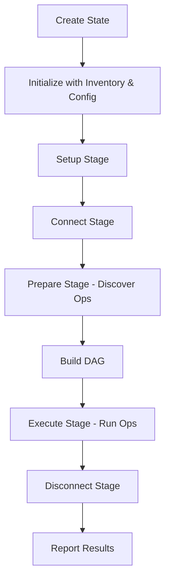

## Overview

The `State` class is the central coordinator for pyinfra deployments. It manages the entire deployment lifecycle, tracks operations across all hosts, coordinates parallel execution, and maintains the current execution stage.

<Note>
Every pyinfra deployment has exactly one State instance that orchestrates all operations, hosts, and connectors.
</Note>

## State Class Definition

From `src/pyinfra/api/state.py:145-283`:

```python
class State:
    """
    Manages state for a pyinfra deploy.
    """

    initialised: bool = False

    # A pyinfra.api.Inventory which stores all our pyinfra.api.Host's
    inventory: Inventory

    # A pyinfra.api.Config
    config: Config

    # Main gevent pool for parallel execution
    pool: Pool

    # Current stage this state is in
    current_stage: StateStage = StateStage.Setup

    # Warning counters by stage
    stage_warnings: dict[StateStage, int] = defaultdict(int)

    # Whether we are executing operations (ie hosts are all ready)
    is_executing: bool = False

    # Whether we should check for operation changes
    check_for_changes: bool = True

    # Print settings
    print_noop_info: bool = False
    print_fact_info: bool = False
    print_input: bool = False
    print_fact_input: bool = False
    print_output: bool = False
    print_fact_output: bool = False

    # Op metadata: shared across all hosts
    op_meta: dict[str, StateOperationMeta] = {}

    # Op data: per-host operation information
    ops: dict[Host, dict[str, StateOperationHostData]] = {}

    # Meta: per-host operation statistics
    meta: dict[Host, StateHostMeta] = {}

    # Results: per-host execution results
    results: dict[Host, StateHostResults] = {}
```

## State Initialization

Creating and initializing a State:

```python
from pyinfra.api import State, Inventory, Config

# Create inventory
inventory = Inventory(
    (["web1.example.com", "web2.example.com"], {}),
)

# Create config
config = Config(
    PARALLEL=10,
    TIMEOUT=30,
)

# Create and initialize state
state = State()
state.init(inventory, config)
```

### Initialization Process

From `src/pyinfra/api/state.py:206-283`:

```python
def init(
    self,
    inventory: Inventory,
    config: Optional[Config],
    initial_limit=None,
):
    # Create default config if not provided
    if config is None:
        config = Config()

    # Calculate optimal parallelism if not set
    if not config.PARALLEL:
        cpus = cpu_count()
        ideal_parallel = cpus * 20  # ~20 per CPU core
        config.PARALLEL = min(ideal_parallel, len(inventory), MAX_PARALLEL)

    # Initialize callback handlers
    self.callback_handlers: list[BaseStateCallback] = []

    # Setup greenlet pools for parallel execution
    self.pool = Pool(config.PARALLEL)
    self.fact_pool = Pool(config.PARALLEL)

    # Assign inventory/config
    self.inventory = inventory
    self.config = config

    # Host tracking sets
    self.activated_hosts: set[Host] = set()
    self.active_hosts: set[Host] = set()
    self.failed_hosts: set[Host] = set()

    # Dynamic host limiting
    self.limit_hosts: list[Host] = initial_limit

    # Initialize operation tracking for each host
    self.op_meta: dict[str, StateOperationMeta] = {}
    self.ops: dict[Host, dict[str, StateOperationHostData]] = {
        host: {} for host in inventory
    }
    self.meta: dict[Host, StateHostMeta] = {
        host: StateHostMeta() for host in inventory
    }
    self.results: dict[Host, StateHostResults] = {
        host: StateHostResults() for host in inventory
    }

    # Link state back to inventory/config and initialize hosts
    inventory.state = config.state = self
    for host in inventory:
        host.init(self)

    self.initialised = True
```

## State Stages

State progresses through five distinct stages:

```python
# From src/pyinfra/api/state.py:93-104
class StateStage(IntEnum):
    # Setup - collect inventory & data
    Setup = 1
    # Connect - connect to the inventory
    Connect = 2
    # Prepare - detect operation changes
    Prepare = 3
    # Execute - execute operations
    Execute = 4
    # Disconnect - disconnect from the inventory
    Disconnect = 5
```

### Stage Transitions

```python
# From src/pyinfra/api/state.py:284-287
def set_stage(self, stage: StateStage) -> None:
    if stage < self.current_stage:
        raise Exception("State stage cannot go backwards!")
    self.current_stage = stage
```

Stages can only move forward:

```python
state.set_stage(StateStage.Setup)     # Initial stage
state.set_stage(StateStage.Connect)   # Connect to hosts
state.set_stage(StateStage.Prepare)   # Discover operations
state.set_stage(StateStage.Execute)   # Execute operations
state.set_stage(StateStage.Disconnect) # Cleanup

# This would raise an exception:
# state.set_stage(StateStage.Prepare)  # Can't go backwards!
```

## Operation Tracking

State maintains three levels of operation data:

### StateOperationMeta

Shared metadata about an operation across all hosts:

```python
# From src/pyinfra/api/state.py:106-117
class StateOperationMeta:
    names: set[str]              # Operation names
    args: list[str]              # Operation arguments (for display)
    op_order: tuple[int, ...]    # Ordering information
    global_arguments: AllArguments  # Execution arguments

    def __init__(self, op_order: tuple[int, ...]):
        self.op_order = op_order
        self.names = set()
        self.args = []
        self.global_arguments = {}  # type: ignore
```

Accessing operation metadata:

```python
op_meta = state.get_op_meta(op_hash)
print(f"Operation: {', '.join(op_meta.names)}")
print(f"Arguments: {op_meta.args}")
print(f"Order: {op_meta.op_order}")
```

### StateOperationHostData

Host-specific operation data:

```python
# From src/pyinfra/api/state.py:119-125
@dataclass
class StateOperationHostData:
    command_generator: Callable[[], Iterator[PyinfraCommand]]
    global_arguments: AllArguments
    operation_meta: OperationMeta
    parent_op_hash: Optional[str] = None  # For nested operations
```

Accessing host operation data:

```python
op_data = state.get_op_data_for_host(host, op_hash)
for command in op_data.command_generator():
    # Execute command
    pass
```

### StateHostMeta

Statistics about operations on a host:

```python
# From src/pyinfra/api/state.py:127-135
class StateHostMeta:
    ops = 0              # Total operations
    ops_change = 0       # Operations that will change
    ops_no_change = 0    # Operations with no changes
    op_hashes: set[str]  # Set of operation hashes

    def __init__(self) -> None:
        self.op_hashes = set()
```

Accessing host metadata:

```python
meta = state.get_meta_for_host(host)
print(f"Total ops: {meta.ops}")
print(f"Will change: {meta.ops_change}")
print(f"No change: {meta.ops_no_change}")
```

### StateHostResults

Execution results for a host:

```python
# From src/pyinfra/api/state.py:137-143
class StateHostResults:
    ops = 0                 # Operations executed
    success_ops = 0        # Successful operations
    error_ops = 0          # Failed operations
    ignored_error_ops = 0  # Failed but ignored operations
    partial_ops = 0        # Partially completed operations
```

Accessing results:

```python
results = state.get_results_for_host(host)
print(f"Success: {results.success_ops}/{results.ops}")
print(f"Errors: {results.error_ops}")
print(f"Ignored: {results.ignored_error_ops}")
```

## Host Management

### Activating Hosts

```python
# From src/pyinfra/api/state.py:370-380
def activate_host(self, host: Host):
    """
    Flag a host as active.
    """
    logger.debug("Activating host: %s", host)

    # Add to *both* activated and active
    # activated tracks all hosts ever activated
    # active tracks currently active (non-failed) hosts
    self.activated_hosts.add(host)
    self.active_hosts.add(host)
```

### Failing Hosts

```python
# From src/pyinfra/api/state.py:382-424
def fail_hosts(self, hosts_to_fail, activated_count=None):
    """
    Flag a set of hosts as failed, error if exceeding FAIL_PERCENT.
    """
    if not hosts_to_fail:
        return

    activated_count = activated_count or len(self.activated_hosts)

    logger.debug(
        "Failing hosts: {}".format(", ".join(host.name for host in hosts_to_fail))
    )

    self.failed_hosts.update(hosts_to_fail)
    self.active_hosts -= hosts_to_fail

    # Check we're not above the fail percent
    active_hosts = self.active_hosts

    # No hosts left!
    if not active_hosts:
        raise PyinfraError("No hosts remaining!")

    if self.config.FAIL_PERCENT is not None:
        percent_failed = (1 - len(active_hosts) / activated_count) * 100

        if percent_failed > self.config.FAIL_PERCENT:
            raise PyinfraError(
                f"Over {self.config.FAIL_PERCENT}% of hosts failed ({int(round(percent_failed))}%)"
            )
```

### Limiting Hosts

```python
# From src/pyinfra/api/state.py:426-435
def is_host_in_limit(self, host: Host):
    """
    Returns a boolean indicating if the host is within the current state limit.
    """
    limit_hosts = self.limit_hosts

    if not isinstance(limit_hosts, list):
        return True
    return host in limit_hosts
```

Usage:

```python
# Limit deployment to specific hosts
web1 = inventory.get_host("web1.example.com")
state.limit_hosts = [web1]

# Check if host is in limit
for host in inventory:
    if state.is_host_in_limit(host):
        # Run operations on this host
        pass
```

## Operation Ordering (DAG)

State builds a Directed Acyclic Graph (DAG) of operations to determine execution order:

```python
# From src/pyinfra/api/state.py:310-344
def get_op_order(self):
    ts: TopologicalSorter = TopologicalSorter()

    # Build DAG from each host's operation order
    for host in self.inventory:
        for i, op_hash in enumerate(host.op_hash_order):
            if not i:
                ts.add(op_hash)  # First op has no dependencies
            else:
                ts.add(op_hash, host.op_hash_order[i - 1])  # Depends on previous

    final_op_order = []

    try:
        ts.prepare()
    except CycleError as e:
        raise PyinfraError(
            "Cycle detected in operation ordering DAG.\n"
            f"    Error: {e}\n\n"
            "    This can happen when using loops in operation code"
        )

    while ts.is_active():
        # Sort operations that can run in parallel by line number
        node_group = sorted(
            ts.get_ready(),
            key=lambda op_hash: self.op_meta[op_hash].op_order,
        )
        ts.done(*node_group)
        final_op_order.extend(node_group)

    return final_op_order
```

### DAG Example

```python
from pyinfra.operations import apt, server

# These operations create a DAG:
apt.update()              # Op 1: No dependencies
apt.packages(             # Op 2: Depends on Op 1 (order matters)
    packages=["nginx"],
)
server.service(           # Op 3: Depends on Op 2 (nginx must be installed)
    service="nginx",
    running=True,
)

# State builds this DAG:
# Op 1 (apt.update)
#   ↓
# Op 2 (apt.packages)
#   ↓
# Op 3 (server.service)
```

## Parallel Execution

State uses gevent for concurrent execution:

```python
# From src/pyinfra/api/state.py:26-38
# Calculate max parallelism based on file descriptors
try:
    from resource import RLIMIT_NOFILE, getrlimit

    nofile_limit, _ = getrlimit(RLIMIT_NOFILE)
    MAX_PARALLEL = round((nofile_limit - 10) / 3)
except ImportError:
    nofile_limit = 0
    MAX_PARALLEL = 100000
```

### Parallel Pools

```python
# Two separate pools
self.pool = Pool(config.PARALLEL)       # For operations
self.fact_pool = Pool(config.PARALLEL)  # For facts
```

Example parallel execution:

```python
import gevent
from pyinfra.context import ctx_host

def run_on_host(host):
    with ctx_host.use(host):
        # Run operations on this host
        pass

# Execute on all hosts in parallel
greenlets = [
    state.pool.spawn(run_on_host, host)
    for host in state.inventory
]

# Wait for all to complete
gevent.joinall(greenlets)
```

## Callback System

State supports callbacks for monitoring execution:

```python
# From src/pyinfra/api/state.py:41-91
class BaseStateCallback:
    # Host callbacks
    @staticmethod
    def host_before_connect(state: State, host: Host):
        pass

    @staticmethod
    def host_connect(state: State, host: Host):
        pass

    @staticmethod
    def host_disconnect(state: State, host: Host):
        pass

    # Operation callbacks
    @staticmethod
    def operation_start(state: State, op_hash):
        pass

    @staticmethod
    def operation_host_success(state: State, host: Host, op_hash, retry_count: int = 0):
        pass

    @staticmethod
    def operation_host_error(state: State, host: Host, op_hash, retry_count: int = 0):
        pass

    @staticmethod
    def operation_end(state: State, op_hash):
        pass
```

### Registering Callbacks

```python
from pyinfra.api.state import BaseStateCallback

class MyCallbacks(BaseStateCallback):
    @staticmethod
    def host_connect(state, host):
        print(f"Connected to {host.name}")

    @staticmethod
    def operation_host_success(state, host, op_hash, retry_count=0):
        op_meta = state.get_op_meta(op_hash)
        print(f"[{host.name}] Success: {', '.join(op_meta.names)}")

    @staticmethod
    def operation_host_error(state, host, op_hash, retry_count=0):
        op_meta = state.get_op_meta(op_hash)
        print(f"[{host.name}] Error: {', '.join(op_meta.names)}")

# Register callbacks
state.add_callback_handler(MyCallbacks())
```

### Triggering Callbacks

```python
# From src/pyinfra/api/state.py:305-308
def trigger_callbacks(self, method_name: str, *args, **kwargs):
    for handler in self.callback_handlers:
        func = getattr(handler, method_name)
        func(self, *args, **kwargs)

# Triggered internally by pyinfra
state.trigger_callbacks("host_connect", host)
state.trigger_callbacks("operation_host_success", host, op_hash)
```

## Warning Tracking

State tracks warnings per stage:

```python
# From src/pyinfra/api/state.py:289-293
def increment_warning_counter(self) -> None:
    self.stage_warnings[self.current_stage] += 1

def get_warning_counter(self) -> int:
    return self.stage_warnings[self.current_stage]
```

Usage:

```python
# Increment warning count
state.increment_warning_counter()

# Get warnings for current stage
warnings = state.get_warning_counter()
print(f"Warnings in {state.current_stage}: {warnings}")
```

## State Accessors

### Operation Methods

```python
# Get operation metadata
op_meta = state.get_op_meta(op_hash)

# Get operation data for a host
op_data = state.get_op_data_for_host(host, op_hash)

# Set operation data for a host
state.set_op_data_for_host(host, op_hash, op_data)
```

### Host Methods

```python
# Get host metadata (statistics)
meta = state.get_meta_for_host(host)

# Get host results
results = state.get_results_for_host(host)
```

## Configuration

State holds a reference to the Config object:

```python
# Access config values
parallel = state.config.PARALLEL
timeout = state.config.TIMEOUT
fail_percent = state.config.FAIL_PERCENT

# Modify config (before execution)
state.config.TIMEOUT = 60
state.config.PARALLEL = 20
```

## Print Flags

Control output verbosity:

```python
# From src/pyinfra/api/state.py:173-179
print_noop_info: bool = False      # Print "noop: reason"
print_fact_info: bool = False      # Print "loaded fact X"
print_input: bool = False          # Print commands before execution
print_fact_input: bool = False     # Print fact commands
print_output: bool = False         # Print command output
print_fact_output: bool = False    # Print fact output
```

Usage:

```python
# Enable verbose output
state.print_input = True
state.print_output = True
state.print_fact_info = True

# Disable output
state.print_output = False
```

## State in API Mode

Using State programmatically:

```python
from pyinfra.api import State, Inventory, Config
from pyinfra.api.operation import add_op
from pyinfra.api.operations import run_ops
from pyinfra.operations import apt

# Create state
inventory = Inventory((["web1", "web2"], {}))
config = Config(PARALLEL=10)
state = State()
state.init(inventory, config)

# Add operations
add_op(state, apt.update, _sudo=True)
add_op(state, apt.packages, packages=["nginx"], _sudo=True)

# Execute operations
run_ops(state)

# Check results
for host in inventory:
    results = state.get_results_for_host(host)
    print(f"{host.name}: {results.success_ops} successful, {results.error_ops} errors")
```

## State Lifecycle



Complete lifecycle:

```python
from pyinfra.api import State, Inventory, Config
from pyinfra.api.state import StateStage

# 1. Create
state = State()
inventory = Inventory((["host1"], {}))
config = Config()

# 2. Initialize
state.init(inventory, config)
state.set_stage(StateStage.Setup)

# 3. Connect
state.set_stage(StateStage.Connect)
for host in inventory:
    host.connect()

# 4. Prepare (discover operations)
state.set_stage(StateStage.Prepare)
state.check_for_changes = True
# ... operations are called here ...

# 5. Build DAG
op_order = state.get_op_order()

# 6. Execute
state.set_stage(StateStage.Execute)
state.is_executing = True
# ... operations are executed here ...

# 7. Disconnect
state.set_stage(StateStage.Disconnect)
for host in inventory:
    host.disconnect()

# 8. Results
for host in inventory:
    results = state.get_results_for_host(host)
    print(f"{host.name}: {results.success_ops}/{results.ops} successful")
```

## Best Practices

<CardGroup cols={2}>
  <Card title="One State Per Deploy" icon="circle-1">
    Create a single State instance for each deployment. Don't reuse State objects.
  </Card>
  
  <Card title="Initialize Early" icon="bolt">
    Initialize State with inventory and config before any operations.
  </Card>
  
  <Card title="Monitor Callbacks" icon="bell">
    Use callbacks for logging, metrics, and monitoring deployment progress.
  </Card>
  
  <Card title="Check Results" icon="check-circle">
    Always check execution results after deployment to verify success.
  </Card>
  
  <Card title="Handle Failures" icon="shield">
    Set FAIL_PERCENT to control how many host failures are acceptable.
  </Card>
  
  <Card title="Limit When Needed" icon="filter">
    Use limit_hosts to restrict operations to specific hosts during debugging.
  </Card>
</CardGroup>

## Common Patterns

### Progress Tracking

```python
class ProgressCallback(BaseStateCallback):
    def __init__(self):
        self.total_ops = 0
        self.completed_ops = 0

    @staticmethod
    def operation_host_success(state, host, op_hash, retry_count=0):
        self.completed_ops += 1
        progress = (self.completed_ops / self.total_ops) * 100
        print(f"Progress: {progress:.1f}%")

tracker = ProgressCallback()
state.add_callback_handler(tracker)
```

### Error Collection

```python
class ErrorCollector(BaseStateCallback):
    def __init__(self):
        self.errors = []

    @staticmethod
    def operation_host_error(state, host, op_hash, retry_count=0):
        op_meta = state.get_op_meta(op_hash)
        self.errors.append({
            "host": host.name,
            "operation": ", ".join(op_meta.names),
            "op_hash": op_hash,
        })

collector = ErrorCollector()
state.add_callback_handler(collector)

# After execution
if collector.errors:
    print(f"Errors occurred: {len(collector.errors)}")
    for error in collector.errors:
        print(f"  {error['host']}: {error['operation']}")
```

### Dry Run

```python
# Enable change detection without execution
state.check_for_changes = True
state.set_stage(StateStage.Prepare)

# Operations are discovered but not executed
# ... call operations ...

# Check what would change
for host in inventory:
    meta = state.get_meta_for_host(host)
    print(f"{host.name}: {meta.ops_change} operations will change")
```

## Related Concepts

<CardGroup cols={2}>
  <Card title="Architecture" icon="sitemap" href="/concepts/architecture">
    Understand how State coordinates the two-phase execution model
  </Card>
  
  <Card title="Operations" icon="gear" href="/concepts/operations">
    Learn how operations are tracked in State
  </Card>
  
  <Card title="Inventory" icon="server" href="/concepts/inventory">
    See how State manages hosts and groups
  </Card>
  
  <Card title="Connectors" icon="plug" href="/concepts/connectors">
    Understand how State coordinates connector execution
  </Card>
</CardGroup>
